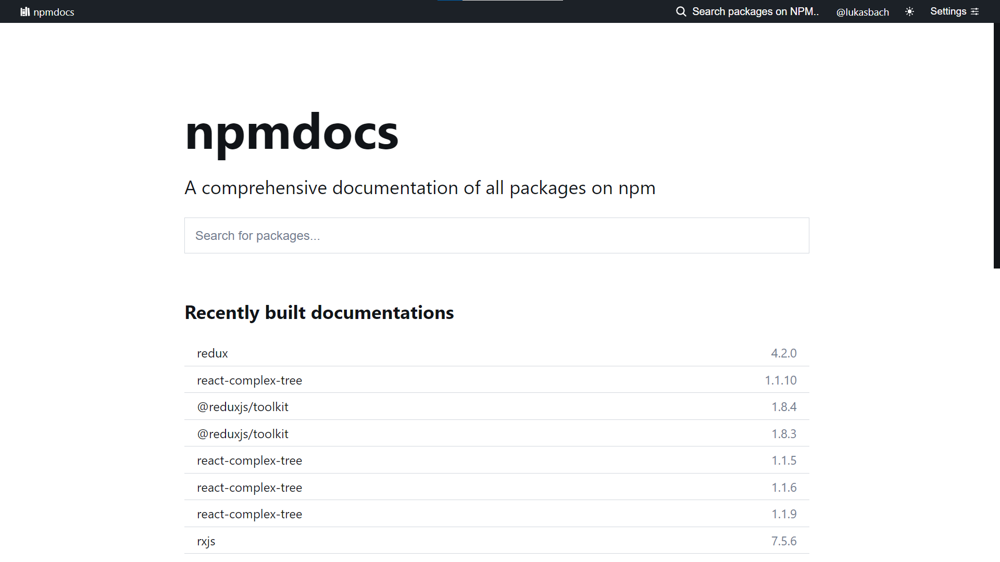
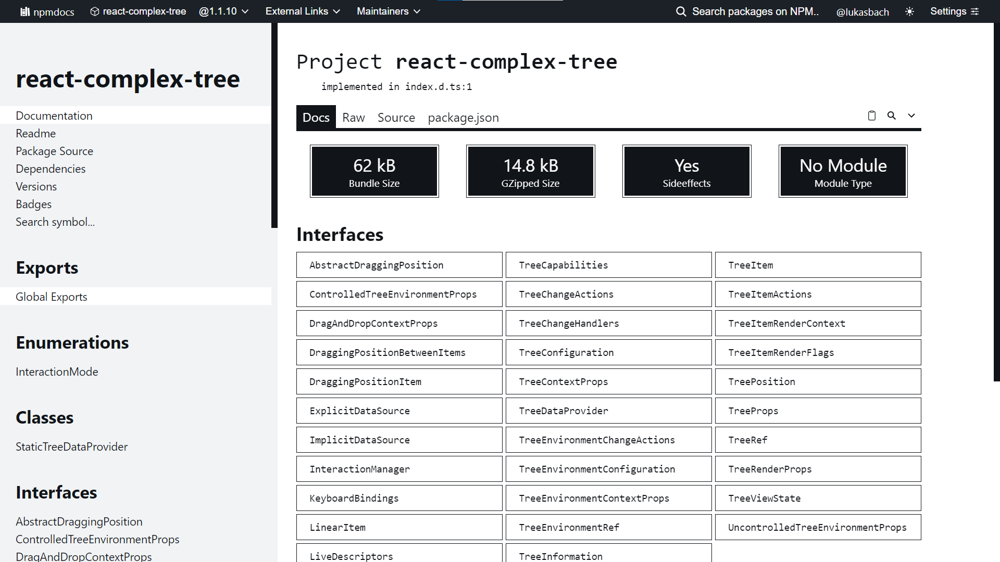
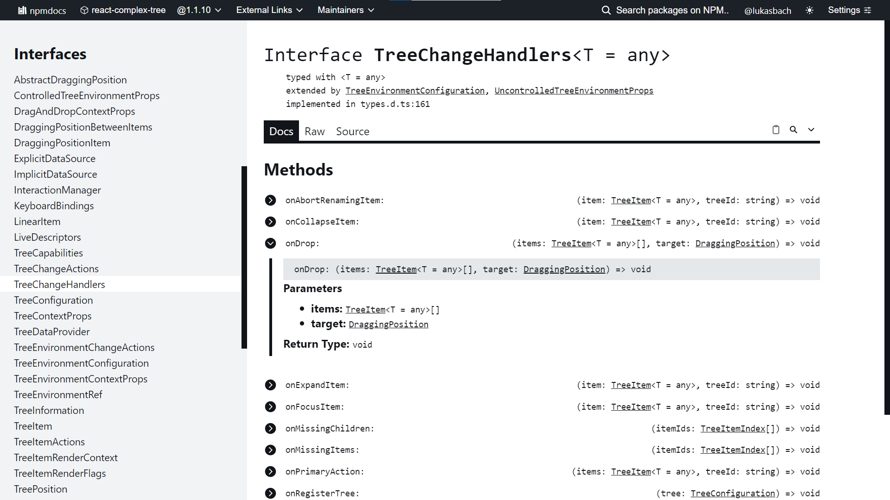
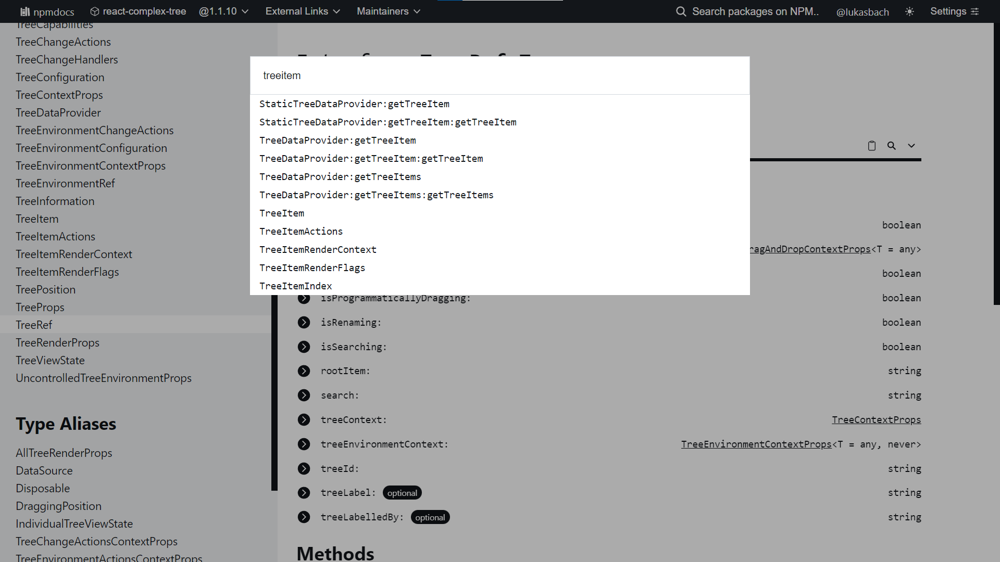
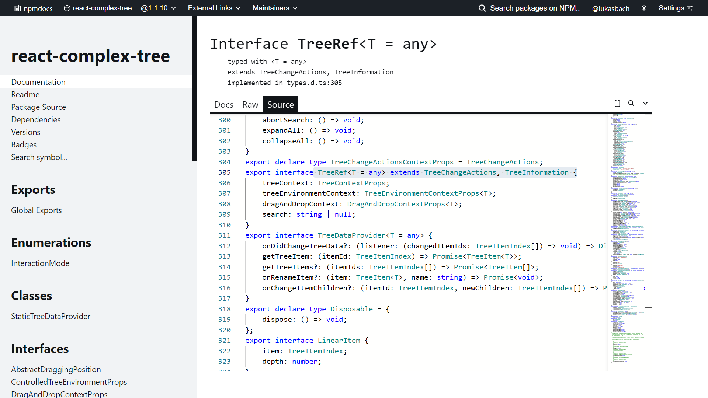

# npmdocs

> A comprehensive documentation of all packages on npm

<div style="text-align: center;">
Check it out now at <a href="https://npmdocs.vercel.app">npmdocs.vercel.app</a>!
</div>

npmdocs is a website with typedocs for all packages available on npm. Any package that has type declarations
either bundled or in the respective `@types/` package is available. For new packages that were not yet built, 
new builds will be triggered ad-hoc and will be available after about 30 seconds.

npmdocs uses [TypeDoc](https://typedoc.org/) under the hood to generate type documentations that are served
by npmdocs. Features include:

- Search any package, for any version, that is available on npm
- See all exports of a package, meticulously documented
- Search through all symbols of a package, both exports and individual properties
- Get stable links to copy and share with your users or coworkers, such as [npmdocs.vercel.app/redux/4.2.0#applyMiddleware](https://npmdocs.vercel.app/redux/4.2.0#applyMiddleware)
- Browse through the package's source code
- Directly view the bundle size, powered by [Bundlephobia](https://bundlephobia.com/)
- Convenient links to Bundlephobia, Packagephobia, its repo and npm page
- Hotkeys, Darkmode and more convenience features!







## Maintenance

### App

Changes to the app are automatically deployed to vercel (branch deployments are supported).
To run locally, you need a data repo where package data is stored. Create a `packages/app/.env.local` file with the 
following contents:

```env
VERCEL="1"
VERCEL_ENV="development"
VERCEL_URL=""
VERCEL_GIT_PROVIDER=""
VERCEL_GIT_REPO_SLUG=""
VERCEL_GIT_REPO_OWNER=""
VERCEL_GIT_REPO_ID=""
VERCEL_GIT_COMMIT_REF=""
VERCEL_GIT_COMMIT_SHA=""
VERCEL_GIT_COMMIT_MESSAGE=""
VERCEL_GIT_COMMIT_AUTHOR_LOGIN=""
VERCEL_GIT_COMMIT_AUTHOR_NAME=""
NPMDOCS_GH_AUTH="YOUR_GITHUB_AUTH_HERE"
NPMDOCS_REPO="YOUR_GITHUB_USER_HERE/YOUR_DATA_REPO_NAME_HERE"
```

and fill YOUR_GITHUB_AUTH_HERE with a github auth token that can write to your repo, and 
YOUR_GITHUB_USER_HERE/YOUR_DATA_REPO_NAME_HERE according to your user name.

### Build tool

The buildtool can be tested by running

    yarn start package-name package-version target-folder

in `packages/buildtool` e.g.:

    yarn start react-complex-tree 1.1.9 ./out

To deploy changes to the buildtool, deploy it from the root folder of the repo with ``lerna publish``.
